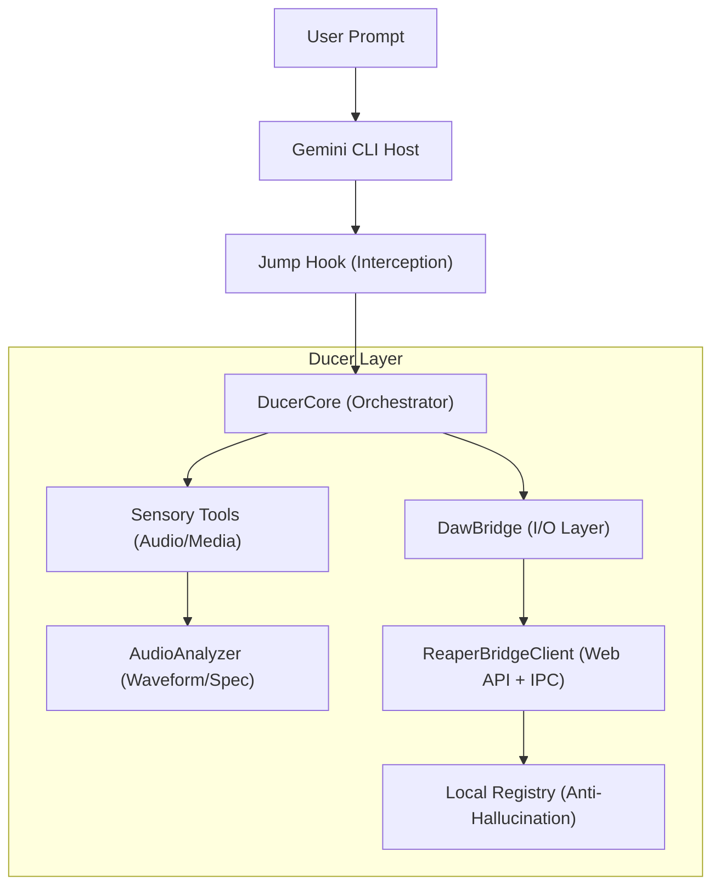

<p align="center">
  
</p>

# 🎚️ Ducer CLI

> **The Advanced Music Producer Edition of Gemini CLI.**  
> Terminal-first AI agent for professional music production and DAW
> orchestration.

<p align="left">
  <a href="https://github.com/julesklord/ducer-cli/actions/workflows/ci.yml/badge.svg?branch=ducer"></a>
  <a href="https://github.com/julesklord/ducer-cli"></a>
  <a href="./LICENSE"></a>
  <a href="https://github.com/julesklord/ducer-cli/tree/ducer"></a>
  <a href="https://www.geminicli.com"></a>
</p>

---

### 🎙️ The Producer's Agent

Ducer is what happens when a producer who actually engineers audio decides to
build the tool they needed to exist. Not a chatbot wrapper. Not a plugin GUI. A
proper **terminal agent** that speaks REAPER's language natively, can analyze
audio multimodally via Gemini 1.5 Pro's 1M token context window, generates and
executes Lua scripts on demand, and validates every action ID before it touches
your session.

> [!TIP] **Ducer Philosophy:** Layered Information. High-performance density
> with maximum clarity.

---

## 🕹️ How it Works



The **"Jump Hook"** is a passive router injected into the CLI — it intercepts
music subcommands and delegates them to `DucerCore` without modifying any
upstream code. This means `git merge upstream/main` stays clean.

---

## ⚡ Quick Start

### Installation

**Requirements:** Node.js >= 20.0.0, REAPER with
[Web Control](https://www.reaper.fm/sdk/web/web.php) enabled.

```bash
# Clone the production branch
git clone -b ducer https://github.com/julesklord/ducer-cli.git
cd ducer-cli

# Install and build
npm install
npm run build

# Link it globally
npm link
```

### Usage Examples

| Command                                           | Description                                   |
| :------------------------------------------------ | :-------------------------------------------- |
| `ducer`                                           | **Interactive Producer Mode** (REAPER linked) |
| `ducer do --query "Sidechain route track 1 to 2"` | Natural language DAW control                  |
| `ducer analyze --file mix.wav`                    | standard audio analysis                       |
| `ducer analyze --file mix.wav --advanced`         | Generates **Premium HTML Report**             |
| `ducer service`                                   | Persistent IPC loop (DAW ↔ LLM)              |

---

## 🏗️ Architecture

### 🛡️ Anti-Hallucination Loop

Before any action ID reaches REAPER, Ducer validates it. If the ID is invalid,
it performs a **semantic search** against the local registry and suggests the
correct one.

```text
User: "Run action PLAY_ID_999"
  ↳ validateAction("PLAY_ID_999")
    ↳ Lua: ReverseLookup → "INVALID"
      ↳ semanticSearchFallback → Suggested: 40001 (Transport: Play)
        ↳ executeAction(40001) ✓
```

### 🌉 DawBridge Interface

Adding a new DAW is simple. Implement the `DawBridge` interface
(`plugins_music/src/bridge_interface.ts`) and you're done.

- `executeAction(id)` / `executeScript(code)`
- `validateAction(id)` (Anti-hallucination)
- `getStatus()` (Playhead, Play state, Project path)
- `isBridgeAvailable()`

---

## 🗺️ Roadmap

- [x] DawBridge interface + REAPER implementation
- [x] Web Control API + File IPC dual transport
- [x] Anti-Hallucination loop via action registry
- [x] Audio analysis (standard / advanced / lite modes)
- [x] HTML report generation
- [ ] Ableton Live & Logic Pro bridges
- [ ] Whisper local transcription integration
- [ ] Spectrogram / chromagram terminal rendering

---

## 🤝 Contributing

We welcome contributions at the intersection of **Audio Engineering**, **Lua
Scripting**, and **LLM Orchestration**.

See [`plugins_music/README.md`](./plugins_music/README.md) for the full API
reference.

---

<p align="center">
  
  <br>
  <a href="https://github.com/julesklord/ducer-cli/tree/ducer">ducer branch</a> ·
  <a href="./plugins_music/README.md">API Reference</a> ·
  <a href="./ROADMAP.md">Roadmap</a>
</p>

---

### 📦 Gemini CLI Core

_Ducer is an extension of the Gemini CLI ecosystem._

#### Releases & Support

- **Stable:** `npm install -g @google/gemini-cli@latest` (Tuesdays 20:00 UTC)
- **Preview:** `npm install -g @google/gemini-cli@preview` (Tuesdays 23:59 UTC)
- **Nightly:** `npm install -g @google/gemini-cli@nightly` (Daily 00:00 UTC)

#### Key Features

- **Code Understanding:** Query and edit large codebases.
- **Automation:** Handle PRs, rebases, and complex workflows.
- **Advanced Tools:** Google Search grounding, Token Caching, MCP Servers.

#### Authentication

1. **Google Account:** `gemini` (Standard login)
2. **API Key:** `export GEMINI_API_KEY="..."`
3. **Vertex AI:** `export GOOGLE_GENAI_USE_VERTEXAI=true`

---

<p align="center">
  <small>License: Apache-2.0 | Copyright 2025-2026 Google LLC & Jules Martins</small>
</p>
