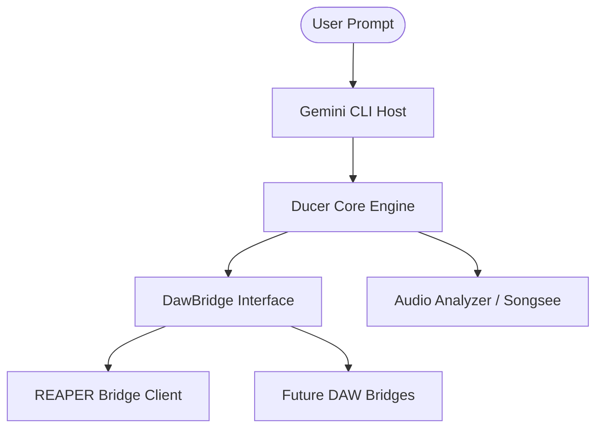

# Ducer - The Gemini Producer Edition

[](https://github.com/julesklord/ducer-cli/actions/workflows/ci.yml)
[](https://github.com/julesklord/ducer-cli)
[](https://github.com/julesklord/ducer-cli/blob/main/LICENSE)

**Ducer** is a high-performance, terminal-first AI agent designed for advanced
music production and DAW orchestration. Built as a hard fork of the **Google
Gemini CLI**, Ducer integrates world-class LLM reasoning directly into the
producer's workflow, bridging the gap between natural language intent and
clinical technical execution.

Learn all about Ducer in our [Core Manual](./README_GEMINI.md).

---

## 🚀 Why Ducer?

- **🎼 DAW-Native Intelligent Control**: Specialized hooks for REAPER and future
  bridges for Ableton and Logic Pro.
- **🔬 Multimodal Audio Auditing**: High-fidelity analysis of frequency
  response, dynamic range, and tonal balance.
- **🏗️ Decoupled Architecture**: Modular `DawBridge` system ensuring your music
  logic stays safe during base CLI updates.
- **🛡️ Maintenance Shield**: Built-in compatibility sentinels that protect your
  custom production tools from upstream regressions.
- **🔌 Enterprise Ready**: Leverage the full 1M token context window of Gemini
  1.5 Pro for entire project instrumentation.

---

## 📦 Installation

Ducer is optimized for high-speed terminal usage and DAW integration.

### Quick Install

```bash
# Clone the Ducer Branch
git clone -b ducer https://github.com/julesklord/ducer-cli.git
cd ducer-cli

# Standard Installation
npm install
npm run build
```

### Global Shortcut

To access Ducer from anywhere in your filesystem:

```bash
# Link the workspace
npm link
```

Now you can invoke: `ducer music` or `ducer chat`.

---

## 📋 Key Features

### 🎹 DAW Orchestration

- **Action Execution**: Search and run 300+ REAPER actions via semantic query.
- **Dynamic Scripting**: Generate and execute localized Lua scripts for complex
  project automation.
- **Project Telemetry**: Real-time project status, track metadata, and FX chain
  auditing.

### 🎙️ Audio Understanding

- **Vocal Transcription**: Local Whisper integration for lyric extraction and
  metadata tagging.
- **Frequency Audit**: Advanced spectral analysis using Gemini's multimodal
  capabilities.
- **Tech Visualization**: Generate spectrograms and chromagrams directly in your
  terminal.

### 🧠 Production Intelligence

- **Macro Learning**: Teach Ducer your personal workflows and map them to
  human-readable names.
- **Anti-Hallucination**: Self-correcting logic that verifies DAW IDs against
  local and remote databases.
- **Contextual Prompts**: Modular system prompts that scale based on analysis
  depth (Lite vs. Advanced).

---

## 🧩 Architecture: The Ducer Bridge

Ducer maintains a strict separation of concerns through its abstraction layer.



---

## 🤝 Contributing

Ducer is an open-source project. We welcome producers and developers to expand
the bridge ecosystem. Check our [Technical Guide](./plugins_music/README.md) for
more info on building new DAW connectors.

---

<p align="center">
  Built with ❤️ for Producers by the Antigravity AI Agent & Google Open Source community
</p>
