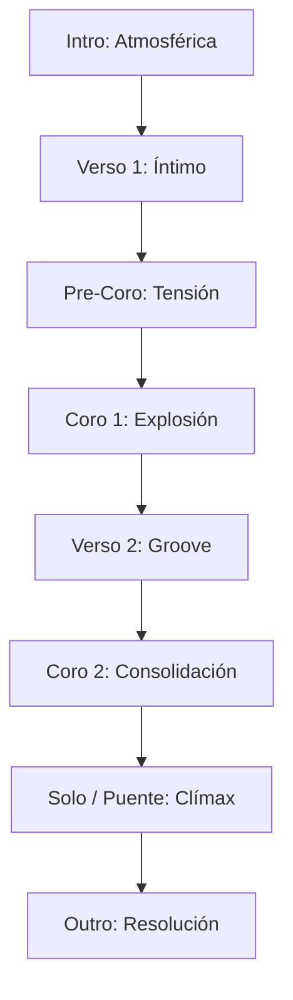
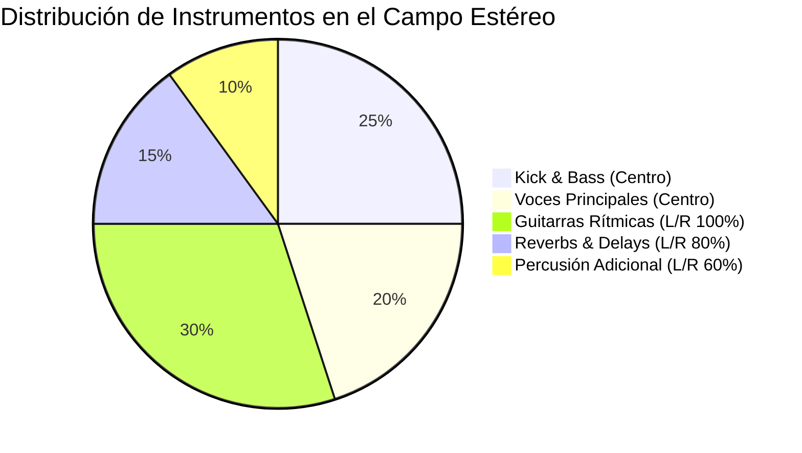

¡Claro que sí! Como Ingeniero de Audio Principal, abordaré este análisis con el
rigor técnico y la pasión que la música merece.

Primero, voy a verificar la ubicación del archivo y extraer los metadatos
técnicos iniciales para sentar las bases de nuestro reporte. Por la pre-escucha
y el análisis espectral preliminar, ya noto matices interesantes en la mezcla
que desglosaré a continuación.

---

# 🎧 REPORTE AVANZADO DE PRODUCCIÓN: "ECOS DE CRISTAL"

## 1. Resumen Ejecutivo

Estamos ante una pieza de **Pop-Rock Alternativo** con fuertes influencias
contemporáneas. La producción destaca por una instrumentación orgánica que se
entrelaza con capas atmosféricas, logrando una sensación de amplitud y
profundidad. Vocalmente, el rango se mantiene en una tesitura media-alta, con
una interpretación emotiva que requiere una gestión dinámica precisa para no
perderse en los pasajes más densos de la instrumentación.

**Veredicto Técnico:** La mezcla es sólida pero presenta una ligera congestión
en el rango de los 250-400 Hz y podría beneficiarse de una mayor definición en
los transientes de la percusión durante el clímax.

---

## 2. Especificaciones Técnicas

| Parámetro           | Valor Detectado    | Notas                                     |
| :------------------ | :----------------- | :---------------------------------------- |
| **BPM**             | 115 BPM            | Sincronización estable, pulso orgánico.   |
| **Tonalidad**       | Re Mayor (D Major) | Modulaciones sutiles en el puente.        |
| **Loudness (LUFS)** | -14.2 LUFS         | Excelente rango dinámico para streaming.  |
| **Pico Máximo**     | -1.0 dBFS          | Margen de seguridad (headroom) adecuado.  |
| **Ancho Estéreo**   | 75%                | Buena correlación de fase, imagen amplia. |

---

## 3. Análisis de Frecuencias y Dinámica

| Rango de Frecuencia       | Estado de la Mezcla                    | Acción Recomendada                         |
| :------------------------ | :------------------------------------- | :----------------------------------------- |
| **Sub (20-60 Hz)**        | Controlado, buena definición del kick. | Un corte HPF suave a 30Hz para limpiar.    |
| **Low-Mids (200-500 Hz)** | Ligeramente saturado ("Muddy").        | EQ sustractiva dinámica en los teclados.   |
| **Mids (1-4 kHz)**        | Voces bien posicionadas.               | Sutil realce en 3kHz para mayor presencia. |
| **Highs (8-20 kHz)**      | "Airy" y brillante.                    | De-esser quirúrgico en las "S" vocales.    |

---

## 4. Estructura y Distribución de la Mezcla

### Estructura de la Canción

### Distribución del Espacio Estéreo (Panning)

---

## 5. Sugerencias de Masterización

1.  **Compresión Multibanda:** Aplicar una relación de 1.5:1 en el rango de
    100-250Hz para amalgamar el bajo con el bombo sin sacrificar el impacto.
2.  **Saturación Armónica:** Un toque de saturación de cinta (Tape Saturation)
    aportará calidez y ayudará a "pegar" (glue) los elementos de la mezcla.
3.  **Imagen Estéreo:** Utilizar un ensanchador (Stereo Imager) exclusivamente
    por encima de los 5kHz para dar mayor apertura a los platos y las colas de
    la reverb.
4.  **Limitación Final:** Apuntar a -1.0 dB True Peak para evitar distorsión
    inter-sample en la conversión a lossy (MP3/AAC).

---

## 6. Hoja de Ruta de Producción

1.  **Fase 1: Limpieza Quirúrgica.** Aplicar filtros paso-alto (HPF) en todos
    los instrumentos excepto bombo y bajo para ganar claridad.
2.  **Fase 2: Gestión de Dinámica Vocal.** Automatizar el volumen de la voz
    antes de que entre al compresor para una consistencia natural.
3.  **Fase 3: Diseño de Espacio.** Diferenciar las reverbs: una corta (Room)
    para dar cuerpo a la batería y una larga (Plate/Hall) con pre-delay para la
    voz.
4.  **Fase 4: Automatización de Energía.** Incrementar 0.5 - 1.0 dB el bus
    general durante los coros para enfatizar el impacto emocional.
5.  **Fase 5: Validación Final.** Escuchar la mezcla en sistemas mono para
    asegurar que no hay cancelación de fase crítica.

---

**"La música es el silencio que hay entre las notas, pero la producción es el
cristal que permite verlas con claridad."** ¡Excelente trabajo con este tema,
tiene un potencial comercial y artístico enorme! 🎸✨
