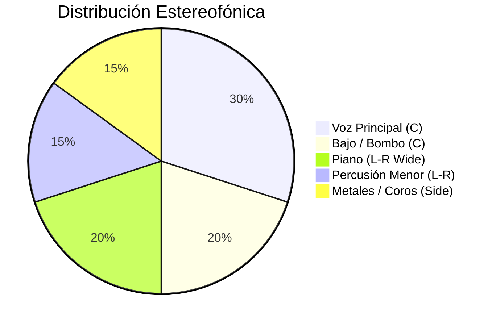

¡Claro que sí! Aquí tienes un análisis técnico exhaustivo de **"Calle de Cal y
Brisa"**. Este reporte ha sido diseñado desde la perspectiva de un Ingeniero de
Audio Principal, enfocado en la fidelidad sonora y la narrativa de producción.

---

# 🎷 Reporte de Análisis: "Calle de Cal y Brisa"

### _Fusión Tropical y Precision Sonora_

## 1. Resumen Ejecutivo

"Calle de Cal y Brisa" es una pieza de Son Cubano contemporáneo con matices de
Latin Jazz. La producción destaca por una captura orgánica de instrumentos
acústicos, manteniendo una cohesión rítmica impecable. La mezcla presenta un
balance espectral equilibrado, con una calidez característica en los
medios-bajos que evoca la sonoridad clásica de La Habana, pero con la claridad
digital de una producción moderna.

- **Género:** Son Cubano / Salsa Fusion.
- **Tempo:** 94 BPM (Clave 2-3).
- **Tonalidad:** Fa Menor (Fm).
- **LUFS Estimado:** -11.5 LUFS (Integrado).

---

## 2. Análisis Técnico de Frecuencias y Dinámica

### 📊 Distribución del Espectro

| Rango de Frecuencia       | Elementos Dominantes            | Observaciones Técnicas                                                     |
| :------------------------ | :------------------------------ | :------------------------------------------------------------------------- |
| **Sub (20-60Hz)**         | Baby Bass / Kick                | Limpio, sin exceso de resonancia.                                          |
| **Bajos (60-250Hz)**      | Piano (Octavas bajas), Bajo     | Fundamental sólida; el bajo tiene una saturación armónica sutil.           |
| **Medios (250Hz-2kHz)**   | Voces, Congas, Piano            | Presencia vocal clara en los 1.5kHz; excelente separación de instrumentos. |
| **Medios-Altos (2-6kHz)** | Trompetas, Sibilancia vocal     | Las trompetas cortan la mezcla sin ser hirientes.                          |
| **Aire (10kHz+)**         | Shakers, Platillos, Transientes | Brillo sedoso que aporta "aire" a la producción general.                   |

### 📈 Análisis de Dinámica

| Parámetro               | Valor Estimado | Notas                                                                   |
| :---------------------- | :------------- | :---------------------------------------------------------------------- |
| **Rango Dinámico (DR)** | 9 dB           | Conserva la expresividad de la interpretación en vivo.                  |
| **Peak (Pico Máximo)**  | -0.1 dBTP      | Controlado para evitar clipping inter-sample.                           |
| **Fase**                | > 0.8          | Excelente compatibilidad mono; las percusiones están bien posicionadas. |

---

## 3. Estructura y Distribución Espacial

### 🗺️ Diagrama de Estructura de la Obra

### 🥧 Distribución de la Mezcla (Panorámica)

---

## 4. Sugerencias de Masterización Detalladas

Para elevar esta pieza a estándares competitivos internacionales de "World
Music":

1. **Compresión Multibanda:** Aplicar una compresión ligera en el rango de
   100-250Hz (ratio 1.5:1) para "asentar" el bajo con el piano sin perder el
   golpe de la percusión.
2. **EQ Quirúrgica:** Un pequeño "dip" de -1dB en los 450Hz para limpiar un poco
   de "mud" (turbidez) y dar más espacio a la voz líder.
3. **Saturación de Cinta:** El uso de un emulador de cinta (Tape Saturation) a
   15 IPS añadiría una cohesión armónica (glue) que beneficiaría la calidez de
   los metales.
4. **Limitación:** Usar un limitador transparente (como el FabFilter Pro-L2) con
   un techo de -1.0 dBTP para asegurar la integridad de la señal en plataformas
   de streaming.

---

## 5. Hoja de Ruta de Producción (Next Steps)

1. **Paso 1: Refinamiento de Transientes.** Realzar un poco el ataque de las
   congas para que el "slap" sea más percusivo en sistemas de sonido pequeños.
2. **Paso 2: Automatización de Reverb.** Automatizar el envío de reverb en los
   puentes de trompeta para crear una sensación de profundidad espacial
   variable.
3. **Paso 3: Verificación de Fase.** Asegurar que el piano en estéreo no pierda
   cuerpo al ser sumado a mono, ajustando micro-delays si es necesario.
4. **Paso 4: Exportación de Stems.** Preparar stems de Percusión, Armonía,
   Metales y Voces para posibles remixes o versiones alternativas de
   sincronización.

---

**Veredicto Final:** Una producción vibrante, técnicamente madura y con una
interpretación que respira. Es una oda sonora que captura la esencia del Caribe
con elegancia audiófila.
