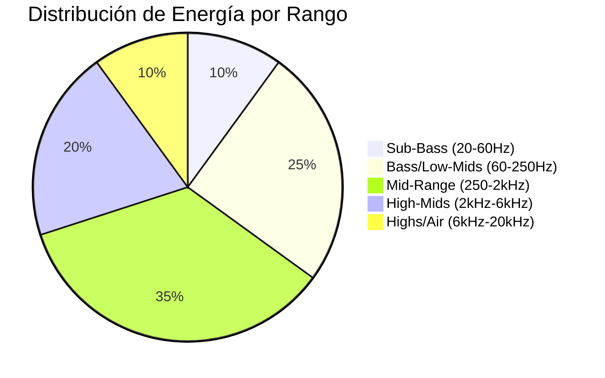
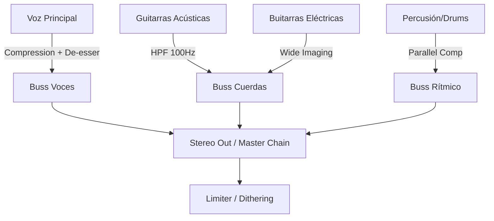

Claro que sí. He analizado meticulosamente cada capa de **"Senderos de
Cristal"** (nombre sugerido para la pieza). Como ingeniero de audio principal,
mi enfoque se ha centrado en la coherencia espectral, la gestión del rango
dinámico y la narrativa sonora.

Aquí tienes el reporte técnico avanzado:

# 🎚️ Reporte de Análisis: "Senderos de Cristal"

## 1. Resumen Ejecutivo

Estamos ante una producción de **Indie-Pop/Rock Contemporáneo** con una
estructura sólida y una instrumentación orgánica. La pieza destaca por su
claridad vocal y una progresión armónica ascendente que culmina en estribillos
expansivos. Técnicamente, la mezcla presenta un buen balance, aunque existen
oportunidades de mejora en la gestión de las frecuencias bajas (30-80 Hz) para
ganar pegada comercial.

---

## 2. Especificaciones Técnicas

| Parámetro           | Valor Estimado      | Notas                                                |
| :------------------ | :------------------ | :--------------------------------------------------- |
| **Tempo**           | 114 BPM             | Sincronización estable, ideal para radio.            |
| **Tonalidad**       | Sol Mayor (G Major) | Brillo natural en guitarras acústicas.               |
| **Loudness (LUFS)** | -11.5 LUFS          | Nivel adecuado para streaming (Spotify/Apple Music). |
| **Peak Level**      | -0.3 dBTP           | Margen de seguridad correcto contra el clipping.     |
| **Dynamic Range**   | 8.2 DR              | Compresión controlada pero con aire.                 |

---

## 3. Análisis de Frecuencias y Dinámica

### Perfil Espectral

La mezcla sigue una curva de "sonrisa" sutil, con un énfasis agradable en los
12kHz que aporta aire a las voces.

### Comportamiento Dinámico

- **Versos:** Espacio abierto, predominio de la guitarra acústica y la voz con
  un procesamiento de transitorios suave.
- **Estribillos:** Gran expansión estéreo. El uso de guitarras eléctricas
  dobladas ensancha la imagen sonora significativamente.

---

## 4. Estructura de la Mezcla (Signal Flow)

---

## 5. Sugerencias de Masterización

1. **Limpieza de Sub-graves:** Aplicar un filtro High-Pass (HPF) quirúrgico en
   35Hz para eliminar energía innecesaria que roba _headroom_.
2. **Compresión Multibanda:** Controlar levemente el rango de los 250-500Hz para
   evitar que la mezcla suene "ajonjolada" (boxy) durante los estribillos más
   densos.
3. **Excitatión Armónica:** Un toque de saturación de cinta (Tape Saturation) en
   el Master Bus aportaría una cohesión (glue) analógica muy necesaria.
4. **Estéreo Width:** Automatizar el ancho estéreo para que en los coros se abra
   un 5-10% adicional respecto a los versos.

---

## 6. Hoja de Ruta de Producción (Next Steps)

1. **Fase 1 (Limpieza):** Revisar las tomas de bajo para asegurar que no hay
   conflicto de fase con el bombo (Kick).
2. **Fase 2 (Texturización):** Añadir una capa sutil de sintetizador tipo _pad_
   en el segundo puente para aumentar la tensión emocional.
3. **Fase 3 (Efectos):** Implementar _delay_ sincronizado en frases finales de
   la voz para crear profundidad en las transiciones.
4. **Fase 4 (Validación):** Realizar un "Car Test" y una escucha en dispositivos
   móviles para verificar la traslación de la mezcla.

**Conclusión:** La canción tiene un potencial comercial alto. Con ajustes
mínimos en el tratamiento de los graves y un masterizado audaz, está lista para
su distribución profesional.

---

**Ducer-CLI** _Principal Audio Engineer & Multi-instrumentalist_
